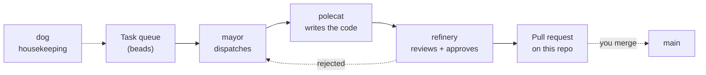

# Actual Factory Demo

Build a working software factory in about fifteen minutes, then watch four agents take a task from a queue to a merged pull request without you touching the code.

This repo is the hands-on companion to a short Claude Code workshop talk, so it's deliberately small. Want the full multi-day curriculum instead? That lives in [`actual-software/sf-tutorial`](https://github.com/actual-software/sf-tutorial), and every page here points back at it.

## What you build

A [Gas City](https://github.com/gastownhall/gascity) factory named `factory1`, wired to this repo as its **rig**, which is the project the factory works on. You hand the factory a task. Four agents then pass it between themselves until the result lands as a pull request:



The work itself is intentionally trivial: generate ASCII art for a letter, with a rhyming couplet underneath. Nobody's here for the ASCII art. The point is the loop around it, meaning how work gets dispatched, who reviews it, and where the quality gate sits.

## Prerequisites

You almost certainly have the first two already. Check the rest before the session starts, because installing things during a fifteen-minute talk doesn't go well.

| Tool | Why | Install |
| --- | --- | --- |
| [Claude Code](https://claude.com/claude-code) | The coding agent the factory drives | See the Claude Code docs |
| [`gh`](https://cli.github.com/) | Agents open pull requests through it | `brew install gh`, then `gh auth login` |
| [`gc`](https://github.com/gastownhall/gascity) 1.3+ | Gas City itself | `brew install gastownhall/gascity/gascity` |
| [`bd`](https://github.com/gastownhall/beads) 1.0+ | The task queue the agents read | Arrives with the Homebrew install above |
| [`dolt`](https://github.com/dolthub/dolt) 2.1+ | Storage behind `bd` | `brew install dolt` |
| `tmux`, `jq`, `git` | Session backend, JSON parsing, version control | See the note below |

**Claude Code is the one paid dependency, and it's the only one.** No other account, subscription, or API key is required.

### About `tmux`

Gas City runs every agent inside a `tmux` session, so it's genuinely required rather than merely recommended. Whether you have to install it yourself depends on how you install Gas City:

- **Homebrew** (`brew install gastownhall/gascity/gascity`) declares `tmux`, `jq`, and `beads` as dependencies, plus `flock` on macOS, so they all arrive automatically. Nothing more to do.
- **Building from source, or grabbing a release binary,** installs only the `gc` binary. Install the rest yourself: `brew install tmux jq flock` on macOS, `apt install tmux jq` on Linux, where `flock` already ships with util-linux.

Homebrew is the recommended path for exactly this reason. Whichever route you took, confirm it with `gc doctor`, which checks each binary dependency and names the ones it can't find.

## Before you start: fork this repo

**This repo is also the rig.** Your factory writes its output back into a checkout of this same repository, so you don't create a second project repo. You do need somewhere you can push, though. Fork it first:

```bash
gh repo fork actual-software/actual-factory-demo --clone --remote
```

Every command in the walkthrough assumes you're working in your fork.

## The walkthrough

Four steps, in order. Each page is copy-paste runnable and ends with a verification block, so you can tell whether a step actually worked before building the next one on top of it.

1. [Install Gas City](./walkthrough/1-install-gas-city.md) — create `factory1`, start the supervisor, meet the mayor
2. [Install the pack](./walkthrough/2-install-the-pack.md) — register this repo as the rig, add the four-agent workflow, seed the task queue
3. [Run the ASCII art task](./walkthrough/3-run-the-ascii-art-task.md) — hand a task to the factory and watch a pull request appear
4. [Walk the configs](./walkthrough/4-walk-the-configs.md) — open the files that made all of that happen

There's also a [bootstrap script](./bootstrap/README.md) that fast-forwards a factory to the end state of any step. Use it to reset between runs, or to catch up when a step goes sideways.

## Skipping the slow parts

Step 3 takes a few minutes of real agent time. That's fine when you're working through this alone. It's awkward when a room is watching.

The **[`ascii-art-complete`](https://github.com/actual-software/actual-factory-demo/tree/ascii-art-complete)** branch holds the finished output: the `ascii/` files a factory run produces, already committed. [Pull request #1](https://github.com/actual-software/actual-factory-demo/pull/1) shows that branch as a diff against `main`, which is roughly what your own factory's pull request will look like when it opens.

```bash
git checkout ascii-art-complete
ls ascii/
```

Use it to skip ahead, to check your own output against a known-good result, or just to see where you're heading before you start.

## Going deeper

This demo stops as soon as one task has made it through the loop. [`sf-tutorial`](https://github.com/actual-software/sf-tutorial) picks up from that same place and keeps layering: a required feedback round before any task becomes a pull request, branch protection so only humans merge to `main`, an architecture-aware reviewer that reads your ADRs, and a review gate on the tasks themselves.

Its `progression/02-first-review-loop.md` is the direct next step after step 3 here.

## Troubleshooting

- [`tmux` scroll behavior](./troubleshooting/tmux.md) — the scroll wheel walking your shell history instead of scrolling
- [CLI coding agents](./troubleshooting/cli-coding-agents.md) — provider setup and authentication problems
- [`gc import add`](./troubleshooting/gc-import-add.md) — packs that don't show up after an import

Each walkthrough page also carries its own troubleshooting section for the failures specific to that step. Start there.

## Community

Questions, or want to show off what you built? Join the [Actual AI User Community Slack](https://join.slack.com/t/actualaiusercommunity/shared_invite/zt-3vibgzapf-ywx0Db29mZ4lhtQJGzZfGQ).
