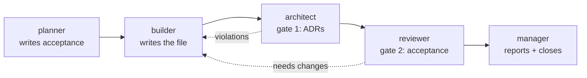

# The `factory` pack

Five agents and one workflow. That's the whole pack, and the emptiness is deliberate.

The workshop walkthrough lives in the [top-level README](../README.md). This file is just the map of what you installed.

## What's in here

```text
factory/
├── pack.toml                          what the pack declares
├── agents/<name>/agent.toml           how each agent runs
├── agents/<name>/prompt.template.md   what each agent knows
└── formulas/ascii-art.formula.toml    the order the five of them work in
```

## The five agents

| Agent | Always on? | Role |
| --- | --- | --- |
| `manager` | Yes | Routes work to the other four and reports back to you |
| `planner` | No | Turns a thin task into acceptance a builder can hit |
| `builder` | No | Writes the file, commits it, opens the pull request |
| `architect` | No | Gate 1, checking the diff against the ADRs in `adrs/` |
| `reviewer` | No | Gate 2, checking the result against the acceptance |

The four that aren't always on are **pool agents**. They spawn when work reaches them, then exit. `max_active_sessions` in each `agent.toml` decides how many of them can be in flight at a time, and today most of them are pinned at one.

## Where the sequence lives

Not in the prompts. None of the five says what runs before it or after it, because the order lives in exactly one file:

```bash
gc formula show ascii-art
```

That separation is the pack's one real idea, and it's worth stealing. A prompt describes a *role*: what this agent judges, what habits it brings, when it stops. The formula describes the *sequence*, meaning who goes first, what each step is expected to produce, and which agent picks the task up afterwards. Want a different order? Edit one file. Want these same five agents working on something that has nothing to do with ASCII art? Then you write a different formula and leave every single prompt alone.



Both dotted lines run back to the builder. That's on purpose. A gate here never fixes the thing it's looking at, because the moment it starts quietly patching the work it has stopped being a gate and turned into a second author.

## Changing something

Want to feel how the pieces fit? Move one value.

Open `agents/builder/agent.toml`, bump `max_active_sessions`, then:

```bash
gc reload
gc status
```

It ships at `1` because every builder shares the one rig checkout, and two of them writing branches into a single working tree will collide. Give each builder a worktree of its own and raising the cap becomes safe. That's probably the next thing you'd build.
