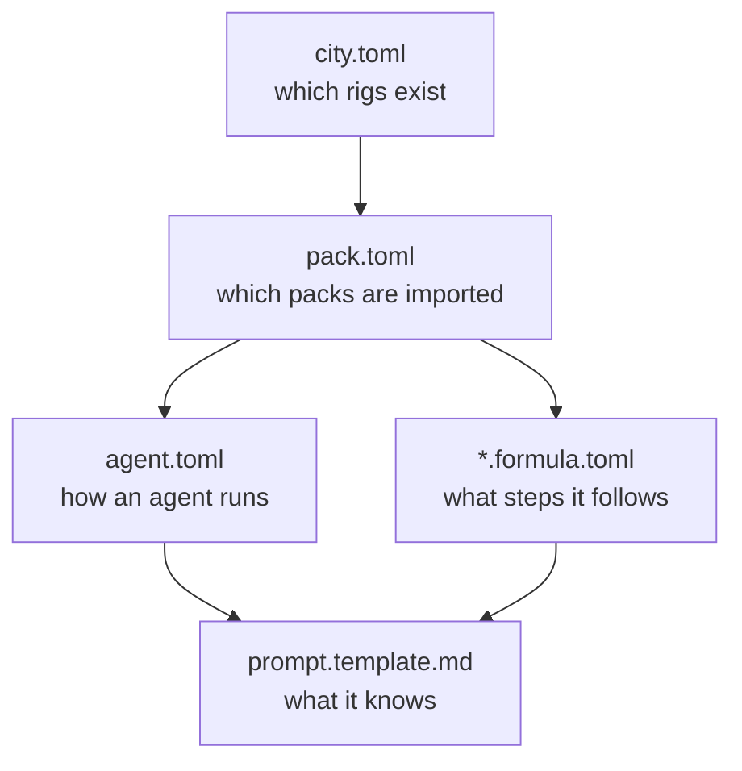

# 4. Walk the configs

« [previous: 3. Run the ASCII art task](./3-run-the-ascii-art-task.md) | [back to README](../README.md) »

## What this covers

The five files that produced everything you just watched. There's nothing to install here. This is the read-through that turns "it worked" into "I could change it."

## The map



Read them in that order, because each layer narrows the one above it.

## 1. `city.toml`: what the factory contains

```bash
cat "$FACTORY_PATH/city.toml"
```

Two blocks: a `[workspace]` naming your provider, and one `[[rigs]]` entry per project. Registering the rig back in step 2 is what added that second block. It's the shortest useful answer to "what does this factory actually work on."

## 2. `pack.toml`: what the factory imports

```bash
cat "$FACTORY_PATH/pack.toml"
gc import list
gc import list --rig ascii-art
```

`pack.toml` records the imports; `gc import list` reads it back and is the authoritative check. Note that `pr-gate-city` sits at city scope and `pr-gate-rig` at rig scope. That split isn't bureaucracy. Gas City resolves agent patches within a single scope, so a pack patching the city-scoped mayor cannot also patch the rig-scoped refinery.

Open `pr-gate-rig`'s own manifest to see the other half of that story:

```bash
cat "$FACTORY_PATH/.gc/system/packs/pr-gate-rig/pack.toml"
```

`[imports.setup]` is why the two packs have to live side by side. A patch resolves against its pack's own agents plus its declared imports, so `pr-gate-rig` imports `setup` in order to find the `refinery` it patches.

## 3. `agent.toml`: how an agent runs

```bash
cat "$FACTORY_PATH/.gc/system/packs/setup/agents/polecat/agent.toml"
```

Eight lines, and they decide the agent's whole operational shape:

```toml
scope = "rig"
wake_mode = "fresh"
work_dir = ".gc/worktrees/{{.Rig}}/polecats/{{.AgentBase}}"
nudge = "Run gc hook; it checks assigned work first, then routed pool work."
pre_start = ["{{.ConfigDir}}/assets/scripts/worktree-setup.sh {{.RigRoot}} {{.WorkDir}} {{.AgentBase}} --sync"]
idle_timeout = "2h"
min_active_sessions = 0
max_active_sessions = 5
```

`max_active_sessions = 5` is the one to notice. Up to five polecats can run at once, and that's how a factory parallelizes: sling five tasks, and five agents claim them. Now compare it against the refinery:

```bash
cat "$FACTORY_PATH/.gc/system/packs/setup/agents/refinery/agent.toml"
```

`max_active_sessions = 1`. That's deliberate. Many workers, one gate. The reviewer is a serialization point, because concurrent merges into the same branch are how you get a mess.

`wake_mode = "fresh"` means each polecat starts with no memory of the last one. Everything it needs comes from the task and the repo. That's why task descriptions matter so much in a factory.

## 4. The formula: what steps it follows

```bash
cat "$FACTORY_PATH/.gc/system/packs/pr-gate-rig/formulas/mol-polecat-pr.formula.toml"
```

A formula is the recipe an agent follows, written out as a dependency graph of steps. This one's worth reading closely, precisely because it's so small:

```toml
formula = "mol-polecat-pr"
extends = ["mol-polecat-work"]
version = 1
```

It inherits every step from the stock `mol-polecat-work` and replaces exactly one of them, `submit-and-exit`, to stamp `merge_strategy=pr` on the task. That single key is what makes the refinery publish a pull request instead of fast-forwarding onto `main`.

This is the demo's most transferable idea. You didn't fork the workflow to change its behavior. You extended it and overrode a single step. The other formula does the same thing on the reviewer side:

```bash
cat "$FACTORY_PATH/.gc/system/packs/pr-gate-rig/formulas/mol-refinery-pr-patrol.formula.toml"
```

It inserts an `approval-review` step between checks and merge-push. That step is the gate you watched clear in step 3.

## 5. `prompt.template.md`: what an agent knows

```bash
cat "$FACTORY_PATH/.gc/system/packs/pr-gate-rig/prompts/refinery.template.md"
```

The prompt holds the agent's standing instructions: its role, its contract, and its exit conditions. The `[[patches.agent]]` block in `pr-gate-rig/pack.toml` swaps this file in over the stock refinery prompt, which is how one pack changes another pack's agent without copying it wholesale.

## Try changing something

The fastest way to feel the loop is to move a single value and watch the behavior follow it.

Open the polecat's `agent.toml`, set `max_active_sessions = 2`, then:

```bash
gc restart
gc status
```

The pool cap changes. Sling three tasks and only two agents pick them up, so the third one just waits its turn. Set it back when you're done playing.

## Where the ADR fits

```bash
cat "$RIG_PATH/docs/decision-records/0001.ADR.ASCII.md"
```

This one isn't factory config at all. It belongs to the project. It pins the shape of every output file: where it lives, its exact structure, the size limits on the art, the two-line rhyme. The agents read it as context, which is why their output is consistent rather than merely plausible.

That separation is the point. The factory is generic and knows nothing about ASCII art. The rig carries the domain rules. Swap the rig and the same four agents work on your codebase instead.

## Where to go next

You've now seen a factory dispatch, implement, review, and publish. [`sf-tutorial`](https://github.com/actual-software/sf-tutorial) continues from here and adds the gates this demo left out: a required feedback round before anything becomes a pull request, branch protection so only humans merge to `main`, an architecture-aware reviewer that reads your ADRs, and a review gate on the tasks themselves.

Start at its [`progression/02-first-review-loop.md`](https://github.com/actual-software/sf-tutorial/blob/main/progression/02-first-review-loop.md), which picks up exactly where step 3 stopped.

« [previous: 3. Run the ASCII art task](./3-run-the-ascii-art-task.md) | [back to README](../README.md) »
